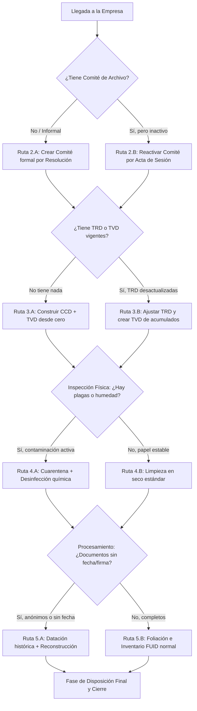

# 🏛️ Guía Metodológica y Lista de Chequeo Maestra para la Organización de Fondos Acumulados

Esta guía constituye el marco técnico, metodológico y normativo de referencia para la intervención, organización y regularización de los **Fondos Documentales Acumulados** en la organización, bajo los lineamientos del Archivo General de la Nación (AGN) de Colombia. Sirve como base metodológica para que el asistente de la plataforma actúe como un cocreador del proceso de organización.

---

## 📌 PARTE 1: LISTA DE CHEQUEO MAESTRA (CHECKLIST DE PUNTA A PUNTA)

Esta checklist secuencial detalla cada paso obligatorio para llevar los fondos acumulados desde el desorden absoluto hasta su entrega formal al 100% bajo la norma colombiana.

### 🗂️ Fase 1: Diagnóstico Técnico e Inspección Preliminar
- [ ] **1.1. Inspección visual y física del depósito:** Registrar metros lineales aproximados de estanterías, cantidad estimada de cajas, sacos o carpetas sueltas.
- [ ] **1.2. Evaluación ambiental y estructural:** Medir humedad relativa, temperatura, ventilación, presencia de filtraciones de agua o iluminación solar directa.
- [ ] **1.3. Cuestionario de línea base institucional:** Entrevistar a los empleados con mayor antigüedad para reconstruir la historia del archivo (¿quién guardaba?, ¿con qué criterio?).
- [ ] **1.4. Inventario de herramientas preexistentes:** Confirmar la existencia previa de organigramas históricos, reglamentos de archivo, manuales de funciones o manuales de procesos.
- [ ] **1.5. Clasificación del escenario inicial (Rama de Decisión):**
  - *Escenario A:* Sin comité, sin manuales, sin instrumentos (TRD/TVD).
  - *Escenario B:* Con TRD vigentes, pero con acumulados históricos sin clasificar.
  - *Escenario C:* Con comités/manuales informales u obsoletos y sin instrumentos oficiales.
- [ ] **1.6. Elaboración y radicación del Informe Técnico de Diagnóstico:** Presentar los hallazgos iniciales a la gerencia general con el cronograma preliminar de intervención.

### ⚖️ Fase 2: Gobernanza y Creación de la Estructura de Decisión (Comité de Archivo)
- [ ] **2.1. Definición de integrantes del Comité de Archivo:** Asignar cargos clave (Gerente/Delegado, Contador/Director Financiero, Asesor Jurídico, Responsable de Archivo/Tecnología).
- [ ] **2.2. Elaboración de la Resolución / Acta de Creación:** Redactar el documento formal que constituye el Comité de Archivo.
- [ ] **2.3. Sesión inaugural del Comité (Acta N° 01):** Firmar el acta de conformación, definir el reglamento de reuniones y el cronograma del proyecto.
- [ ] **2.4. Resolución de funciones cruzadas:**
  - Separar el rol del *Productor del documento* (quien crea) del *Custodio* (quien resguarda).
  - Definir la responsabilidad civil y penal de los jefes de dependencia sobre la custodia de sus archivos de gestión (Ley 594 de 2000).

### 📐 Fase 3: Construcción de Instrumentos Archivísticos
- [ ] **3.1. Reconstrucción de la Historia Institucional:** Mapear la evolución del organigrama desde la creación de la empresa hasta el presente para entender qué dependencias produjeron los acumulados.
- [ ] **3.2. Cuadro de Clasificación Documental (CCD) Histórico:** Estructurar las series y subseries producidas por cada dependencia inactiva o activa.
- [ ] **3.3. Tablas de Valoración Documental (TVD):**
  - Valorar la documentación que ya cumplió su ciclo activo (valores administrativos, fiscales, legales y contables).
  - Definir los tiempos de retención y la disposición final (Conservación Total, Selección o Eliminación).
- [ ] **3.4. Aprobación y Oficialización de las TVD:** Someter las TVD a revisión del Comité de Archivo y aprobarlas mediante Acta formal.

### 🧪 Fase 4: Adecuación Logística, Seguridad e Intervención Física
- [ ] **4.1. Dotación de EPP (Elementos de Protección Personal):** Suministrar batas de algodón, mascarillas con filtro para material particulado (N95), guantes de nitrilo y gafas de seguridad.
- [ ] **4.2. Adquisición de materiales de archivo (Normas NTC):**
  - Cajas de cartón desacidificado tipo X200 o X300 (NTC 5397).
  - Carpetas de cartón yute libre de ácido o carpetas de cuatro aletas (NTC 4436).
  - Ganchos sujetadores de plástico (plásticos o de polipropileno, prohibido el metal).
- [ ] **4.3. Limpieza en seco:** Eliminar polvo superficial, esporas y suciedad con brochas de cerda suave o aspiradoras con filtro HEPA.
- [ ] **4.4. Estabilización física:** Retirar ganchos metálicos oxidados, clips, bandas elásticas y cintas pegantes que dañan las fibras del papel.
- [ ] **4.5. Depuración documental (Primer Filtro):** Separar documentos de apoyo (copias de facturas, duplicados, circulares informativas sin firma) para posterior eliminación.

### 📂 Fase 5: Clasificación, Ordenación, Foliación e Inventario (FUID)
- [ ] **5.1. Clasificación por series y subseries:** Agrupar los expedientes según el CCD y las TVD aprobadas.
- [ ] **5.2. Ordenación interna:** Organizar el contenido de cada carpeta cronológicamente (el documento más antiguo al principio, el más reciente al final del expediente).
- [ ] **5.3. Foliación sistemática:**
  - Numerar consecutivamente con lápiz de mina negra suave (HB o 2B) en la esquina superior derecha del folio, en sentido de lectura del documento.
  - No foliar folios en blanco ni hojas de apoyo. Máximo 200 folios por carpeta.
- [ ] **5.4. Registro en el FUID (Formato Único de Inventario Documental):**
  - Registrar en el módulo digital de la plataforma cada carpeta y caja indicando: código, serie, subserie, fechas extremas, número de folios, soporte y observaciones.
- [ ] **5.5. Rotulación definitiva:** Imprimir y pegar rótulos a carpetas y cajas indicando códigos del CCD, número de inventario y ubicación.

### ♻️ Fase 6: Valoración, Disposición Final y Transferencia
- [ ] **6.1. Identificación de documentos para eliminación:** Listar detalladamente en el formato FUID los folios/carpetas que según la TVD son objeto de eliminación.
- [ ] **6.2. Elaboración del Acta de Eliminación Documental:** Redactar el acta de eliminación detallando series, volumen y método de destrucción.
- [ ] **6.3. Aprobación y firma de actas de eliminación:** Sesión extraordinaria del Comité de Archivo para autorizar la destrucción del material depurado.
- [ ] **6.4. Destrucción física controlada:** Entregar el papel para reciclaje industrial certificado o trituración controlada (guardar el certificado de destrucción ecológica).
- [ ] **6.5. Transferencia al Archivo Central:** Trasladar las cajas organizadas al depósito central de almacenamiento y actualizar el inventario topográfico en el sistema.

### 📝 Fase 7: Entrega del Informe Final de Gestión y Cierre
- [ ] **7.1. Redacción del Informe Final del Proyecto de Intervención:** Detallar la metodología, metros lineales iniciales vs. finales, volumen depurado e indicadores de avance.
- [ ] **7.2. Ajuste de Manuales Internos (Prevención):**
  - Entregar el Manual de Gestión Documental y el Programa de Gestión Documental (PGD) actualizados para evitar que la empresa vuelva a acumular desorden.
- [ ] **7.3. Capacitación al personal:** Dictar un taller sobre transferencia documental, foliación y ordenación según la nueva directriz.
- [ ] **7.4. Entrega formal a Gerencia:** Firma del acta de entrega de los fondos acumulados al 100% organizados y digitalizados en la plataforma.

---

## 🌲 PARTE 2: PLAN DE RAMIFICACIONES (ÁRBOL DE DECISIONES Y CONTINGENCIAS)

Durante el proceso, el archivista o el asistente digital de la plataforma se toparán con bifurcaciones críticas. A continuación se presentan los caminos técnicos a tomar en cada caso:

### 🛣️ Rama de Decisión 1: Estructura de Gobernanza (Comité)
- **Si el comité no existe o es verbal (Ruta 2.A):**
  - *Acción:* El asistente de la plataforma bloquea el avance y solicita los nombres y cargos de los miembros. Genera la **Resolución de Creación del Comité de Archivo** y un borrador del **Reglamento Interno**. Obliga a subir el PDF firmado del acta inaugural.
- **Si el comité existe pero está inactivo (Ruta 2.B):**
  - *Acción:* Se elabora un **Acta de Reactivación y Nombramiento de Nuevos Miembros**. Se convoca a sesión extraordinaria de inducción archivística a los miembros.

### 📐 Rama de Decisión 2: Instrumentos Archivísticos (TRD/TVD)
- **Si la empresa no cuenta con CCD ni TVD (Ruta 3.A):**
  - *Acción:* Se procede a una investigación retrospectiva del organigrama (reconstrucción histórica). Se identifican los periodos administrativos de la empresa y se crea una **Tabla de Valoración Documental (TVD)** específica para el fondo acumulado.
- **Si existen TRD pero no cubren el periodo histórico (Ruta 3.B):**
  - *Acción:* Las TRD se aplican a los documentos producidos a partir de su fecha de aprobación. Para los documentos anteriores, se diseña una TVD complementaria.
  - *Recomendación:* No intentes aplicar retroactivamente una TRD moderna a documentos viejos cuyas dependencias productoras ya desaparecieron (ej. un departamento de "Sistemas" de 1990 que hoy es "Tecnología de la Información").

### ☣️ Rama de Decisión 3: Contingencias en la Inspección Física
- **Sub-rama 3.1: Hallazgo de plagas, hongos o humedad activa (Ruta 4.A):**
  - *Qué HACER:* Aislar inmediatamente el lote contaminado en un área ventilada (cuarentena). Suspender la limpieza con brochas (para evitar esparcir esporas). Realizar desinfección ambiental con productos químicos autorizados por el AGN (ej. alcohol isopropílico al 70% o nebulización controlada).
  - *Qué NO HACER:* Mezclar el papel húmedo o con hongos con el archivo sano. Usar cloro o agua directamente sobre el papel.
- **Sub-rama 3.2: Documentos con deterioro físico severo (Rastros de fuego, roturas extremas):**
  - *Acción:* Insertar los documentos en folios de poliéster transparente (mylar) para su manipulación. No aplicar cintas pegantes comerciales (tipo Scotch) para reparar roturas; deterioran el papel a largo plazo. Utilizar papel tissue y adhesivo metilcelulosa si se requiere restauración básica, o limitarse a protegerlos físicamente en fundas libres de ácido.

### 🔍 Rama de Decisión 4: Contingencias en la Ordenación y Descripción
- **Sub-rama 4.1: Documentos sin fecha o sin firma (Ruta 5.A):**
  - *Acción:* Si carece de fecha, buscar indicios en el contenido (menciones de años, nombres de gerentes, fechas de facturación de documentos adyacentes). Si se estima la fecha, registrarla en el FUID entre corchetes, por ejemplo: `[1998]`. Si es imposible determinarla, registrar `S.F.` (Sin Fecha).
  - *Acción:* Si carece de firma un documento vital (ej. un contrato), se clasifica como borrador y se deja registro en la carpeta, marcándolo en el FUID bajo observaciones como "Documento no formalizado".
- **Sub-rama 4.2: Hallazgo de documentos de valor histórico / patrimonial (Ruta 5.C):**
  - *Acción:* Si durante la depuración de fondos acumulados se encuentran documentos de alto valor para la historia de la empresa (ej.: Escritura de constitución original, planos históricos, patentes, cartas de fundadores), se clasificarán como **Conservación Permanente (CT)** con disposición para el Archivo Histórico de la empresa. Estos nunca se eliminan ni se someten a muestreo.

---

## 📋 PARTE 3: RECOMENDACIONES DE ACTUALIZACIÓN DE PROCESOS E INTERFERENCIAS DE CARGO

La intervención física de fondos acumulados revela fallas en el diseño de los procesos cotidianos de la empresa. Para evitar que el desorden vuelva a generarse, se deben emitir las siguientes recomendaciones y actualizaciones de manuales:

### 🔄 1. Actualización del Manual de Procesos y Procedimientos
El desorden de fondos acumulados se genera porque las dependencias no cierran sus procesos de forma organizada. Se debe incorporar al Manual de Procedimientos la siguiente sección:
- **Procedimiento obligatorio de Cierre de Expedientes:**
  1. Al finalizar un trámite (ej. terminación de un contrato o cierre del año fiscal de una factura), el responsable del proceso tiene 15 días hábiles para organizar, foliar y rotular el expediente.
  2. Queda estrictamente prohibido transferir carpetas al Archivo Central que contengan borradores, copias duplicadas, correos electrónicos impresos informales o material metálico.
  3. Toda transferencia debe ir acompañada de su respectivo formato FUID en PDF firmado digitalmente.

### 👤 2. Resolución de Cargos y Funciones Cruzadas
Es común encontrar que el asistente de contabilidad es el mismo que custodia las historias laborales, o que la secretaria de gerencia maneja los contratos y las facturas sin una delimitación clara.
- **Recomendación de Ajuste de Funciones:**
  - *Principio de Procedencia:* Cada dependencia debe custodiar exclusivamente los documentos que genera en ejercicio de sus funciones.
  - *Funciones de Talento Humano:* Las historias laborales deben estar bajo la custodia única del responsable de Talento Humano. Nadie más debe archivar folios en estas carpetas.
  - *Centralización de Contratos:* Los contratos originales deben estar bajo custodia del área jurídica o la secretaría general. Contabilidad solo conservará copias digitales autorizadas para sus procesos de pago.

### 📑 3. Directriz de Eliminación de Papel de Apoyo (Cero Duplicación)
Establecer una política de "Un Solo Original". Si un memorando es enviado a cinco áreas, solo el área emisora tiene la obligación de conservar el documento original firmado en su expediente. Las demás áreas deben eliminar sus copias físicas una vez leído el memorando (o conservarlo únicamente en formato electrónico si el proceso es digital).

---

## 📈 PARTE 4: LA BASE DE DATOS COMO COCREADORA DEL CAMBIO

Cuando el usuario finalice el plan de intervención física y digital de sus fondos acumulados a través de esta guía, el módulo de **Fondos Acumulados** en el sistema contará con:
1. **La estructura del CCD y las TVD** parametrizadas en la base de datos, listas para controlar el ciclo de vida de los nuevos documentos.
2. **El inventario FUID digitalizado** al 100%, lo que permite búsquedas instantáneas de expedientes históricos mediante palabras clave o ubicaciones físicas.
3. **El registro de actas del Comité de Archivo**, garantizando el valor probatorio y la legalidad de todas las acciones de retención y eliminación de la empresa ante el Archivo General de la Nación.

Esta guía metodológica asegura que el arranque del proyecto sea excelente y la entrega final, impecable.
